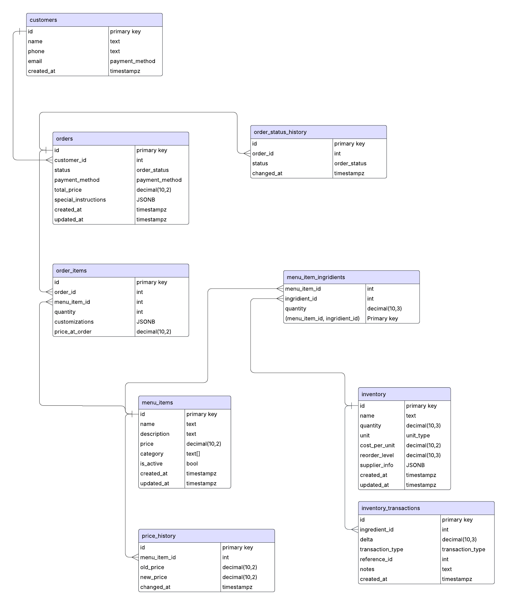

# frappuccino

### entity relationship diagram:



# Frappuccino Order Management System

## Overview

Frappuccino is a comprehensive order management system designed for coffee shops and cafes. It provides robust APIs for handling orders, inventory, reporting, and search functionality.

## Features

- **Order Management**: Create, read, update, and delete orders
- **Inventory Tracking**: Real-time inventory updates with transactions
- **Reporting**: Sales reports, popular items, and period-based analytics
- **Search**: Full-text search across menu items, orders, and ingredients
- **Batch Processing**: Handle multiple orders in a single transaction

## API Documentation

### Base URL

`http://localhost:9090/`

### Endpoints

#### Order Endpoints

    "POST /orders"
    "GET /orders/{id}"
    "PUT /orders/{id}"
    "DELETE /orders/{id}"
    "POST /orders/{id}/close"
    "GET /orders"
    "POST /orders/batch-process"
    "GET /orders/numberOfOrderedItems"

#### Inventory Endpoints

    "POST /inventory"
    "GET /inventory/{id}"
    "PUT /inventory/{id}"
    "DELETE /inventory/{id}"
    "GET /inventory"
    "GET /inventory/getLeftOvers"

#### Menu routes

    "POST /menu"
    "GET /menu/{id}"
    "PUT /menu/{id}"
    "DELETE /menu/{id}"
    "GET /menu"

#### Report Endpoints

```

"GET /reports/orderedItemsByPeriod"
"GET /reports/search"
"GET /reports/total-sales"
"GET /reports/popular-items"

```

## Getting Started

### Prerequisites

- Go 1.21+
- PostgreSQL 15+

## Examples

### Batch Order

```
POST http://localhost:9090/orders/batch-process

{
  "orders": [
    {
      "customer_id": 1,
      "items": [
        {
          "menu_item_id": 2,
          "quantity": 2,
          "customizations": {
            "milk": "oat",
            "size": "large"
          }
        },
        {
          "menu_item_id": 2,
          "quantity": 1
        }
      ],
      "special_instructions": "Extra hot for the latte"
    },
    {
      "customer_id": 2,
      "items": [
        {
          "menu_item_id": 2,
          "quantity": 3
        }
      ]
    },
    {
      "customer_id": 3,
      "items": [
        {
          "menu_item_id": 10,
          "quantity": 1
        },
        {
          "menu_item_id": 3,
          "quantity": 2
        }
      ]
    },
    {
      "customer_id": 4,
      "items": [
        {
          "menu_item_id": 4,
          "quantity": 1
        }
      ]
    },
    {
      "customer_id": 5,
      "items": [
        {
          "menu_item_id": 9,
          "quantity": 1
        }
      ]
    }
  ]
}
```

### Create an Order

```
POST http://localhost:9090/orders

{
  "customer_id": 1,
    "payment_method": "credit_card",
    "items": [
      {
        "menu_item_id": 4,
        "quantity": 2,
        "price_at_order": 3.75,
        "customizations": {
          "milk": "oat",
          "extra_shot": true
        }
      },
      {
        "menu_item_id": 9,
        "quantity": 1,
        "price_at_order": 5.50,
        "customizations": {
          "whipped_cream": "extra"
        }
      }
    ],
    "special_instructions": {
      "notes": "Extra hot, please hurry!"
    }
}
```

### Get Sales Report

```bash
curl "http://localhost:9090/reports/sales?start_date=2023-01-01&end_date=2023-01-31"
```

## Database Schema


## Support

For support, please open an issue or contact [your email].
